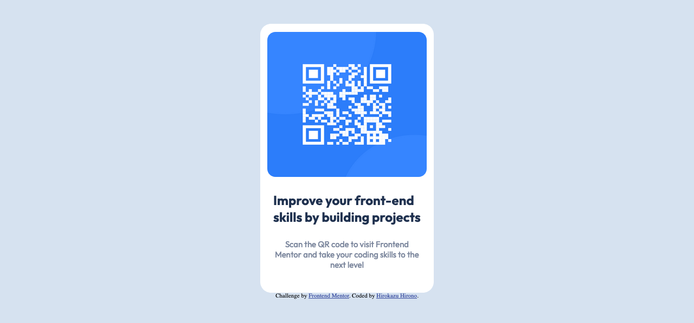

# Frontend Mentor - QR code component solution

This is a solution to the [QR code component challenge on Frontend Mentor](https://www.frontendmentor.io/challenges/qr-code-component-iux_sIO_H). Frontend Mentor challenges help you improve your coding skills by building realistic projects.

## Overview

This is QR code component project in Frontend Mentor.

### Screenshot

### Links

- Solution URL: [https://github.com/hirohiro2255/qrcode-component](Github)
- Live Site URL: [https://mystifying-wright-0b835a.netlify.app/](Netlify)

### Built with

- Elm Language
- CSS Flexbox
- [Elm](https://elm-lang.org/)

## Author

- Frontend Mentor - [@hirohiro2255](https://www.frontendmentor.io/profile/hirohiro2255)
- Twitter - [@hrkzhrn](https://www.twitter.com/hrkzhrn)
